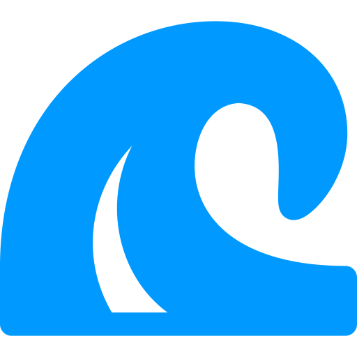

<p align="center">
  
</p>

<h1 align="center">RelWave</h1>

<p align="center">
  <strong>A modern, cross-platform database management and visualization tool</strong><br/>
  Built with Tauri, React, and TypeScript
</p>

<p align="center">
  
  
  
  
</p>

<p align="center">
  <a href="https://github.com/Yashh56/RelWave/releases"><strong>Download</strong></a> |
  <a href="#-features"><strong>Features</strong></a> |
  <a href="#-installation"><strong>Installation</strong></a> |
  <a href="#-contributing"><strong>Contributing</strong></a>
</p>

---

## Overview

RelWave is a **powerful desktop application** that provides an intuitive interface for managing and visualizing your databases. It supports **PostgreSQL** and **MySQL** databases with features like schema exploration, ER diagram generation, query building, and data visualization.

> **Why RelWave?** Unlike web-based tools, RelWave runs natively on your machine with direct database connections, providing better performance and security.

## Features

### Database Management
- **Multi-database support** - Connect to multiple PostgreSQL and MySQL databases
- **Secure storage** - Credential encryption with machine-specific keys
- **Health monitoring** - Connection status and health checks
- **Statistics dashboard** - Database metrics at a glance

### Schema Explorer
- **Visual browsing** - Navigate schemas, tables, and columns
- **Constraint details** - View types, indexes, and constraints
- **Relationship mapping** - Inspect foreign key relationships
- **Metadata panel** - Detailed information for any object

### ER Diagram
- **Auto-generation** - Instant entity relationship diagrams
- **Interactive canvas** - Zoom, pan, and rearrange nodes
- **Relationship lines** - Visual foreign key connections
- **Export support** - Save diagrams as PNG images

### Query Builder
- **Visual interface** - Build queries without writing SQL
- **Drag and drop** - Add tables by dragging nodes
- **SQL generation** - Auto-generate SQL from selections
- **Instant execution** - Run and view results immediately

### SQL Workspace
- **Multi-tab editor** - Work on multiple queries simultaneously
- **Syntax highlighting** - SQL-aware code editor
- **Execution metrics** - Query timing and row counts
- **Query history** - Track and rerun previous queries

### Data Visualization
- **Chart generation** - Visualize query results instantly
- **Multiple types** - Bar, line, pie, and area charts
- **Customization** - Configure axes, colors, and labels
- **Export options** - Save charts as images

### Additional Features
- **Dark/Light themes** - Choose your preferred appearance
- **Auto-updates** - Automatic update notifications
- **Cross-platform** - Windows and Linux support
- **Developer mode** - Access DevTools for debugging

## Tech Stack

| Layer | Technologies |
|-------|-------------|
| **Frontend** | React 19, TypeScript, Vite, TailwindCSS |
| **UI Components** | Radix UI, Lucide Icons |
| **Diagrams** | React Flow, Dagre (auto-layout) |
| **Charts** | Recharts |
| **SQL Editor** | CodeMirror |
| **State Management** | TanStack Query |
| **Desktop Runtime** | Tauri 2 (Rust) |
| **Database Bridge** | Node.js with pg, mysql2 drivers |

## Prerequisites

Before building from source, ensure you have:

| Requirement | Version |
|------------|--------|
| **Node.js** | 20 or later |
| **pnpm** | 8 or later |
| **Rust** | 1.70 or later |
| **Build Tools** | Visual Studio Build Tools (Windows) or build-essential (Linux) |

## Installation

### From Releases (Recommended)

Download the latest release for your platform from the [**Releases**](https://github.com/Yashh56/RelWave/releases) page:

| Platform | File Type | Description |
|----------|----------|-------------|
| **Windows** | `.exe` | NSIS installer (recommended) |
| **Windows** | `.msi` | MSI installer |
| **Linux** | `.deb` | Debian/Ubuntu package |
| **Linux** | `.AppImage` | Portable application |

### From Source

1. Clone the repository:
```bash
git clone https://github.com/Yashh56/RelWave.git
cd RelWave
```

2. Install frontend dependencies:
```bash
pnpm install
```

3. Install bridge dependencies:
```bash
cd bridge
pnpm install
cd ..
```

4. Run in development mode:
```bash
pnpm tauri dev
```

## Building

### Windows

```bash
# Build the bridge
cd bridge
pnpm build
cd ..
npx pkg ./bridge/dist/index.cjs --target node18-win-x64 --output ./src-tauri/resources/bridge-x86_64-pc-windows-msvc.exe

# Build the application
pnpm tauri build
```

Output files will be in `src-tauri/target/release/bundle/`.

### Linux

```bash
# Install dependencies (Ubuntu/Debian)
sudo apt install libwebkit2gtk-4.1-dev libappindicator3-dev librsvg2-dev patchelf

# Build the bridge
cd bridge
pnpm build
cd ..
npx pkg ./bridge/dist/index.cjs --target node18-linux-x64 --output ./src-tauri/resources/bridge-x86_64-unknown-linux-gnu

# Build the application
pnpm tauri build
```

Output files will be in `src-tauri/target/release/bundle/`.

## Project Structure

```
RelWave/
├── src/                    # Frontend React application
│   ├── components/         # React components
│   │   ├── chart/          # Chart visualization components
│   │   ├── common/         # Shared components
│   │   ├── database/       # Database-related components
│   │   ├── er-diagram/     # ER diagram components
│   │   ├── home/           # Home page components
│   │   ├── query-builder/  # Query builder components
│   │   ├── schema-explorer/# Schema explorer components
│   │   └── ui/             # Base UI components
│   ├── hooks/              # Custom React hooks
│   ├── pages/              # Page components
│   ├── services/           # API services
│   ├── types/              # TypeScript types
│   └── lib/                # Utility functions
├── bridge/                 # Node.js database bridge
│   ├── src/
│   │   ├── connectors/     # Database connectors (MySQL, PostgreSQL)
│   │   ├── handlers/       # JSON-RPC handlers
│   │   ├── queries/        # SQL query templates
│   │   ├── services/       # Business logic services
│   │   ├── types/          # TypeScript types
│   │   └── utils/          # Utility functions
│   └── __tests__/          # Jest tests
├── src-tauri/              # Tauri Rust backend
│   ├── src/                # Rust source files
│   ├── capabilities/       # Tauri permissions
│   ├── icons/              # Application icons
│   └── resources/          # Bundled resources
└── .github/
    └── workflows/          # GitHub Actions workflows
```

## Configuration

### Database Connections

Database connection configurations are stored in:

| Platform | Location |
|----------|----------|
| **Windows** | `%APPDATA%\relwave\databases.json` |
| **Linux** | `~/.relwave/databases.json` |

> **Note:** Credentials are **encrypted** and stored separately in a `.credentials` file using machine-specific keys.

### Environment Variables

| Variable | Description |
|----------|-------------|
| `RELWAVE_HOME` | Override the default configuration directory |

## Development

### Running Tests

```bash
cd bridge
pnpm test
```

### Architecture

The application uses a **bridge architecture**:

```
┌─────────────────┐     JSON-RPC     ┌─────────────────┐
│   Tauri/React   │ <──────────────> │  Node.js Bridge │
│    Frontend     │   stdin/stdout   │   (pg, mysql2)  │
└─────────────────┘                  └─────────────────┘
                                              │
                                              ▼
                                     ┌─────────────────┐
                                     │    Databases    │
                                     │ PostgreSQL/MySQL│
                                     └─────────────────┘
```

This architecture allows **native database drivers** without Rust bindings.

### Adding a New Database Type

1. Create a new connector in `bridge/src/connectors/`
2. Add query templates in `bridge/src/queries/`
3. Register the connector in `bridge/src/services/databaseService.ts`
4. Update types in `bridge/src/types/`

## Auto-Updates

RelWave includes **automatic update functionality**:

- Checks for updates on application start
- Downloads updates in the background
- Prompts to restart when ready
- Updates distributed via **GitHub Releases**

> Updates are **cryptographically signed** to ensure authenticity.

## Contributing

Contributions are welcome! Here's how to get started:

1. **Fork** the repository
2. **Create** a feature branch: `git checkout -b feature/my-feature`
3. **Commit** your changes: `git commit -am 'Add my feature'`
4. **Push** to the branch: `git push origin feature/my-feature`
5. **Submit** a pull request

Please ensure your code follows the existing style and includes appropriate tests.

## License

This project is licensed under the **MIT License** - see the [LICENSE](LICENSE) file for details.

---

## Acknowledgments

Built with these amazing open-source projects:

| Project | Description |
|---------|-------------|
| [**Tauri**](https://tauri.app/) | Desktop application framework |
| [**React**](https://react.dev/) | UI library |
| [**React Flow**](https://reactflow.dev/) | Node-based diagram library |
| [**Recharts**](https://recharts.org/) | Charting library |
| [**Radix UI**](https://www.radix-ui.com/) | Accessible UI components |
| [**TailwindCSS**](https://tailwindcss.com/) | Utility-first CSS framework |

## Attribution

- Logo icon designed by [**Freepik**](https://www.freepik.com) from [**Flaticon**](https://www.flaticon.com)

---

<p align="center">
  Made with care by <a href="https://github.com/Yashh56">Yash Saini</a>
</p>
