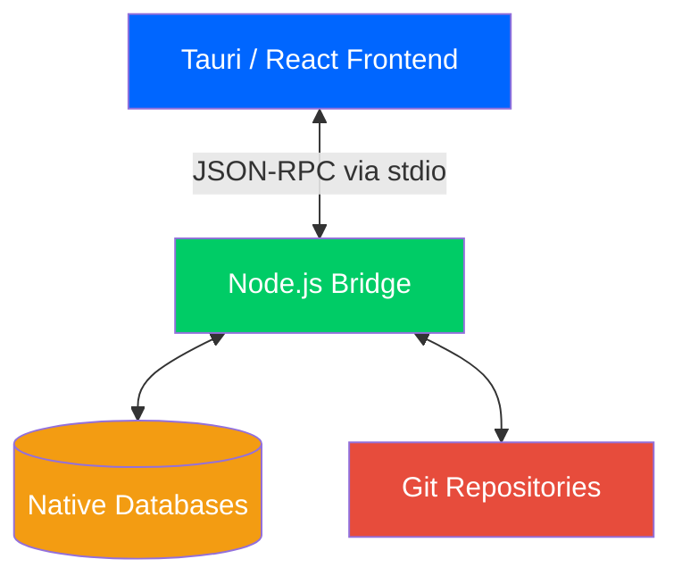

<div align="center">


# RelWave

### **Elevate Your Database Experience**

**Modern Management · Visual Schema Design · Native Git Version Control**

_A high-performance, cross-platform desktop suite for developers who demand more from their database tools._

[](https://github.com/Relwave/relwave-app/releases)
[](LICENSE)
[](https://github.com/Relwave/relwave-app/releases)
[](https://tauri.app/)

[**🚀 Quick Start**](#quick-start) • [**📥 Download**](https://github.com/Relwave/relwave-app/releases)

---

</div>

## Why RelWave?

**RelWave** isn't just another database client. It's a cohesive environment where schema exploration, visual modeling, and version control collide. Built on a native bridge architecture, it delivers the power of low-level drivers with the elegance of a modern React interface.

<div align="center">
<table>
  <tr>
    <td align="center" width="25%">
      <br />
      
      <h4>Native Core</h4>
      <p>Direct connections via native drivers. Zero browser overhead. Pure speed.</p>
    </td>
    <td align="center" width="25%">
      <br />
      
      <h4>Git Integrated</h4>
      <p> DB tool with first-class Git support. Commit your schema changes naturally.</p>
    </td>
    <td align="center" width="25%">
      <br />
      
      <h4>Secure & Private</h4>
      <p>Local-first design. Encrypted credentials stored in your system's secure keyring.</p>
    </td>
    <td align="center" width="25%">
      <br />
      
      <h4>Visual First</h4>
      <p>ER Diagrams, Query Builders, and Data Visualization built directly into your workflow.</p>
    </td>
  </tr>
</table>
</div>

---

## 🛠️ Technology Stack

<div align="center">
<br />

<br /><br />
<i>Powered by Tauri, React 19, and a high-speed Node.js Bridge.</i>
</div>

---

## 🚀 Quick Start

### Installation

For a full setup guide, see [INSTALLATION.md](INSTALLATION.md).

| OS          | Format               | Link                                                                  |
| :---------- | :------------------- | :-------------------------------------------------------------------- |
| **Windows** | `.exe` / `.msi`      | [Download Installer](https://github.com/Relwave/relwave-app/releases) |
| **Linux**   | `.deb` / `.AppImage` | [Download Package](https://github.com/Relwave/relwave-app/releases)   |

### Development Setup

```bash
# Clone the repository
git clone https://github.com/Relwave/relwave-app.git
cd relwave-app

# Install everything
pnpm install
pnpm --dir bridge install

# Launch development environment
pnpm tauri dev
```

If you need custom bridge database values, copy [bridge/.env.example](bridge/.env.example) to `bridge/.env` and adjust the local settings.

---

## 🏗️ Architecture

RelWave leverages a **Hybrid Bridge Architecture**. This unique setup ensures that while the UI remains fluid and responsive, the heavy-duty database and Git operations run in a dedicated, secure Node.js process.


```mermaid
graph TD
    A[Tauri / React Frontend] <-->|JSON-RPC via stdio| B[Node.js Bridge]
    B <--> C[(Native Databases)]
    B <--> D[Git Repositories]
    style A fill:#0066ff,color:#fff
    style B fill:#00cc66,color:#fff
    style C fill:#f39c12,color:#fff
    style D fill:#e74c3c,color:#fff
```

---

## 🤝 Contributing

We love contributions! Whether it's a bug fix, a new feature, or a documentation improvement, your help makes RelWave better for everyone.

See the full contributing guide in [CONTRIBUTING.md](CONTRIBUTING.md).

1.  **Fork** the project.
2.  **Create** your feature branch (`git checkout -b feature/amazing-feature`).
3.  **Commit** your changes (`git commit -m 'Add some amazing feature'`).
4.  **Push** to the branch (`git push origin feature/amazing-feature`).
5.  **Open** a Pull Request.

---

<div align="center">

Built with ❤️ by the RelWave team.  
[Report Bug](https://github.com/Relwave/relwave-app/issues) · [Request Feature](https://github.com/Relwave/relwave-app/issues)

</div>
